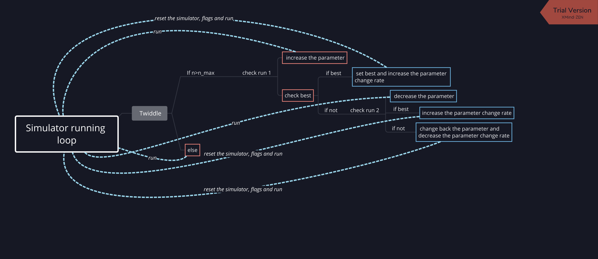

# My solution for CarND-Controls-PID project

---
[](http://www.udacity.com/drive)


## Dependencies

* cmake >= 3.5
 * All OSes: [click here for installation instructions](https://cmake.org/install/)
* make >= 4.1(mac, linux), 3.81(Windows)
  * Linux: make is installed by default on most Linux distros
  * Mac: [install Xcode command line tools to get make](https://developer.apple.com/xcode/features/)
  * Windows: [Click here for installation instructions](http://gnuwin32.sourceforge.net/packages/make.htm)
* gcc/g++ >= 5.4
  * Linux: gcc / g++ is installed by default on most Linux distros
  * Mac: same deal as make - [install Xcode command line tools]((https://developer.apple.com/xcode/features/)
  * Windows: recommend using [MinGW](http://www.mingw.org/)
* [uWebSockets](https://github.com/uWebSockets/uWebSockets)
  * Run either `./install-mac.sh` or `./install-ubuntu.sh`.
  * If you install from source, checkout to commit `e94b6e1`, i.e.
    ```
    git clone https://github.com/uWebSockets/uWebSockets 
    cd uWebSockets
    git checkout e94b6e1
    ```
    Some function signatures have changed in v0.14.x. See [this PR](https://github.com/udacity/CarND-MPC-Project/pull/3) for more details.
* Simulator. You can download these from the [project intro page](https://github.com/udacity/self-driving-car-sim/releases) in the classroom.

Fellow students have put together a guide to Windows set-up for the project [here](https://s3-us-west-1.amazonaws.com/udacity-selfdrivingcar/files/Kidnapped_Vehicle_Windows_Setup.pdf) if the environment you have set up for the Sensor Fusion projects does not work for this project. There's also an experimental patch for windows in this [PR](https://github.com/udacity/CarND-PID-Control-Project/pull/3).

## Basic Build Instructions

1. Clone this repo.
2. Make a build directory: `mkdir build && cd build`
3. Compile: `cmake .. && make`
4. Run it: `./pid`. 

Tips for setting up your environment can be found [here](https://classroom.udacity.com/nanodegrees/nd013/parts/40f38239-66b6-46ec-ae68-03afd8a601c8/modules/0949fca6-b379-42af-a919-ee50aa304e6a/lessons/f758c44c-5e40-4e01-93b5-1a82aa4e044f/concepts/23d376c7-0195-4276-bdf0-e02f1f3c665d)

## Editor Settings

We've purposefully kept editor configuration files out of this repo in order to
keep it as simple and environment agnostic as possible. However, we recommend
using the following settings:

* indent using spaces
* set tab width to 2 spaces (keeps the matrices in source code aligned)

## Code Style

Please (do your best to) stick to [Google's C++ style guide](https://google.github.io/styleguide/cppguide.html).


---

## Project overview

PID control is technique to revise the behavior of vehicle such as steering angle and throttle value based on several P(propotional), I(integral) and D(differential) loss components, given the CTE (cross track error).

Take steering angle for example, it can be set by 

$\mathrm{steer}=-K_p*L_p-K_i*L_i-K_d*L_d$


* P component, directly minimize the CTE by setting it with a propotional factor, just using this term can make the real trajectory vary around the reference trajectory.
* In order to avoid the above problem, D component takes effect. It minimizes the change between the two nearby points in the trajectory, which can smooth the real trajectory.
* I component is to compensate the systematic bias.

With c++, I implement PID by:

```

PID::PID() {}

PID::~PID() {}

void PID::Init(double Kp_, double Ki_, double Kd_) {
  /**
   * TODO: Initialize PID coefficients (and errors, if needed)
   */

  this->Kp = Kp_;
  this->Ki = Ki_;
  this->Kd = Kd_;

  this->p_error = 0.0;
  this->d_error = 0.0;
  this->i_error = 0.0;

  this->prev_cte = 0.0;

}

void PID::UpdateError(double cte) {
  /**
   * TODO: Update PID errors based on cte.
   */

  this->p_error = cte;
  this->d_error = cte - this->prev_cte;
  this->i_error += cte;

  this->prev_cte = cte;

}

double PID::TotalError() {
  /**
   * TODO: Calculate and return the total error
   */

  double total_error = this->p_error + this->d_error + this->i_error;

  return total_error;  // TODO: Add your total error calc here!
}

double PID::CalcSteer() {

  double steer_angle = -this->Kp*this->p_error - this->Kd*this->d_error - this->Ki*this->i_error; 

  return steer_angle;


}
```

In order to initialize the proper parameter for the car to move, I first set the I component to zero. Then, I tune the P and D. After I make sure the car can successfully run 700 cycles in the simulator and I make twiddle algorithm to better finetune those parameters. 

## Twiddle

Twiddle algorithm is a proper parameter selection technique, which can minimize the error. The key idea is to tune each individual parameter by increasing and decreasing its values and observe the change of error. If either the direction can favors for the error minimization, the change rate of such direction should be enlarged, otherwise, decrease the change rate. 

Below is the twiddle algorithm implemented for the simulator:




## Result


## Discussion

Bayesian optimization also comes into my mind of parameter tuning, I implement it with python for the robot example utilized in the lecture. I find it can give us a better parameter solution. Please have a check on my [repo](https://github.com/karlTUM/tiny_proj_PID_para_twiddle_bayesian_opti).


